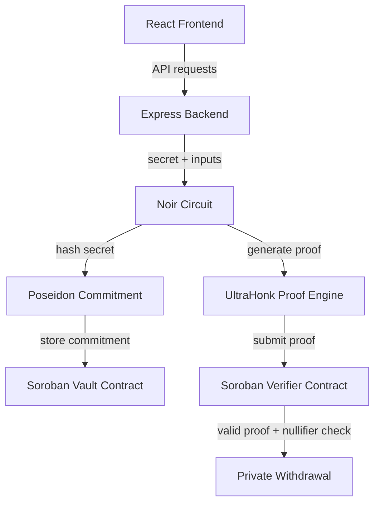
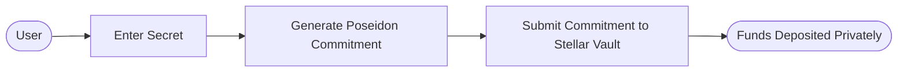
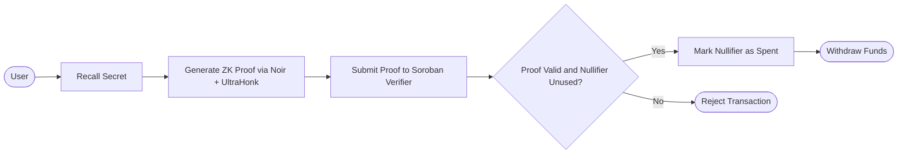
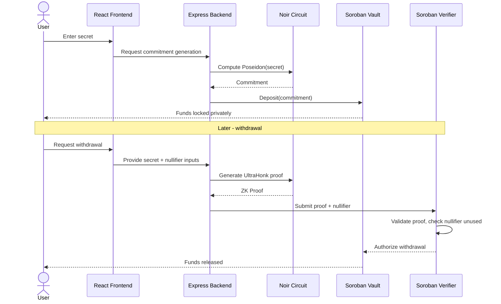

# ShadowVault

> Privacy-preserving vault on Stellar, powered by Zero Knowledge Proofs.

ShadowVault is a privacy-focused vault built on **Stellar Soroban** that lets users securely deposit assets as cryptographic commitments and later prove ownership using **Zero Knowledge Proofs**, without ever revealing their identity, balance, or secret.

Instead of storing sensitive financial information on-chain, ShadowVault stores only a **Poseidon commitment**, enabling private ownership with publicly verifiable correctness.

---

## Table of Contents

- [The Problem](#the-problem)
- [The Solution](#the-solution)
- [Architecture](#architecture)
- [User Flow](#user-flow)
- [End-to-End Flow](#end-to-end-flow)
- [Features](#features)
- [Tech Stack](#tech-stack)
- [Project Structure](#project-structure)
- [Getting Started](#getting-started)
- [Environment Variables](#environment-variables)
- [Running the Project](#running-the-project)
- [Current MVP](#current-mvp)
- [Future Scope](#future-scope)
- [Why ShadowVault](#why-shadowvault)

---

## The Problem

Traditional blockchains are transparent by design. Anyone can see:

- Wallet balances
- Deposits and withdrawals
- Full transaction history
- Treasury movements

Transparency builds trust, but it also leaks sensitive financial data, a dealbreaker for individuals, DAOs, and institutions that need confidentiality.

## The Solution

ShadowVault replaces public ownership records with cryptographic commitments, verified entirely through Zero Knowledge Proofs:

- Deposit funds privately
- Generate a Poseidon commitment
- Store only the commitment on-chain
- Generate a Zero Knowledge ownership proof
- Verify the proof on Stellar via Soroban
- Withdraw securely without revealing private information
- Block replay attacks using nullifiers

---

## Architecture



---

## User Flow

### Deposit



### Withdrawal



---

## End-to-End Flow



---

## Features

| Feature | Description |
|---|---|
| Private Deposits | Assets deposited as commitments, not plaintext records |
| Poseidon Commitments | ZK-friendly hashing for efficient on-chain storage |
| Noir ZK Circuits | Custom circuits define ownership logic |
| UltraHonk Proofs | Fast, succinct proof generation |
| Soroban Verification | On-chain proof verification on Stellar |
| Nullifier Protection | Prevents replay/double-withdrawal attacks |
| Interactive Dashboard | React-based UI for deposits and withdrawals |

---

## Tech Stack

| Layer | Technology |
|---|---|
| Blockchain | Stellar, Soroban Smart Contracts |
| Zero Knowledge | Noir, UltraHonk |
| Cryptography | Poseidon2 Hash |
| Smart Contracts | Rust, Soroban SDK |
| Backend | Node.js, Express.js |
| Frontend | React, Vite |

---

## Project Structure

```
shadow_vault/
├── backend/      # Express API - orchestrates proof & commitment flow
├── frontend/     # React dashboard for deposits/withdrawals
├── contracts/    # Soroban vault & verifier smart contracts
├── circuits/     # Noir ZK circuits
└── artifacts/    # Compiled circuits, proving/verification keys
```

---

## Getting Started

### Prerequisites

Install the following before setting up the project:

| Tool | Purpose | Install |
|---|---|---|
| Node.js (v18+) and npm | Backend and frontend | https://nodejs.org |
| Rust and Cargo | Soroban contract compilation | https://rustup.rs |
| Soroban CLI (`stellar` CLI) | Build and deploy contracts | `cargo install --locked stellar-cli` |
| Nargo (Noir toolchain) | Compile and execute ZK circuits | `curl -L noirup.dev \| bash` then `noirup` |
| Barretenberg (`bb`) | UltraHonk proof generation | `curl -L bbup.dev \| bash` then `bbup` |
| Git | Clone the repository | https://git-scm.com |

### 1. Clone the repository

```bash
git clone https://github.com/<your-org>/shadow_vault.git
cd shadow_vault
```

### 2. Compile the Noir circuits

```bash
cd circuits
nargo compile
```

This produces the circuit artifacts used to generate witnesses and proofs.

### 3. Generate proving and verification keys

```bash
bb write_vk -b ./target/circuits.json -o ../artifacts
bb write_pk -b ./target/circuits.json -o ../artifacts
```

The verification key is later embedded in the Soroban verifier contract.

### 4. Build and deploy the Soroban contracts

```bash
cd ../contracts
stellar contract build

# Deploy the vault contract
stellar contract deploy \
  --wasm target/wasm32-unknown-unknown/release/vault.wasm \
  --source <your-account> \
  --network testnet

# Deploy the verifier contract
stellar contract deploy \
  --wasm target/wasm32-unknown-unknown/release/verifier.wasm \
  --source <your-account> \
  --network testnet
```

Save both returned contract IDs, they are required for the backend configuration in the next step.

### 5. Configure the backend

```bash
cd ../backend
npm install
cp .env.example .env
```

Fill in `.env` with the values described in [Environment Variables](#environment-variables).

### 6. Configure the frontend

```bash
cd ../frontend
npm install
cp .env.example .env
```

Point the frontend at the backend API URL and the deployed contract IDs.

---

## Environment Variables

### Backend (`backend/.env`)

| Variable | Description |
|---|---|
| `PORT` | Port the Express server listens on |
| `STELLAR_NETWORK` | `testnet` or `mainnet` |
| `STELLAR_RPC_URL` | Soroban RPC endpoint |
| `VAULT_CONTRACT_ID` | Deployed vault contract address |
| `VERIFIER_CONTRACT_ID` | Deployed verifier contract address |
| `CIRCUITS_PATH` | Path to compiled Noir circuit artifacts |
| `SOROBAN_SOURCE_SECRET` | Secret key used to sign backend-submitted transactions |

### Frontend (`frontend/.env`)

| Variable | Description |
|---|---|
| `VITE_API_URL` | URL of the running Express backend |
| `VITE_VAULT_CONTRACT_ID` | Deployed vault contract address |
| `VITE_VERIFIER_CONTRACT_ID` | Deployed verifier contract address |
| `VITE_STELLAR_NETWORK` | `testnet` or `mainnet` |

---

## Running the Project

Once dependencies are installed, contracts are deployed, and environment variables are set:

```bash
# Terminal 1 - start the backend
cd backend
npm run dev

# Terminal 2 - start the frontend
cd frontend
npm run dev
```

Open the frontend in your browser (typically `http://localhost:5173`), connect a Stellar testnet account, and walk through the deposit and withdrawal flow described above.

To rebuild circuits or contracts after making changes, repeat the relevant step from [Getting Started](#getting-started) and restart the backend so it picks up any new contract IDs or artifacts.

---

## Current MVP

- React Dashboard
- Express Backend
- Noir Circuit Integration
- Poseidon Commitment Generation
- Soroban Vault Contract
- Private Deposit Flow
- Zero Knowledge Proof Pipeline
- Nullifier-based Replay Protection

## Future Scope

- USDC Integration
- Private Treasury Management
- Yield Strategies
- DAO Treasury Support
- ZK Solvency Proofs
- Institutional Vaults
- Wallet Integration (Freighter, etc.)
- Cross-chain Privacy

---

## Why ShadowVault

ShadowVault combines the privacy guarantees of Zero Knowledge Proofs with the security and speed of Stellar. Instead of exposing financial information publicly, users prove ownership cryptographically, making blockchain applications viable for individuals, DAOs, and institutions that require confidentiality without sacrificing verifiability.