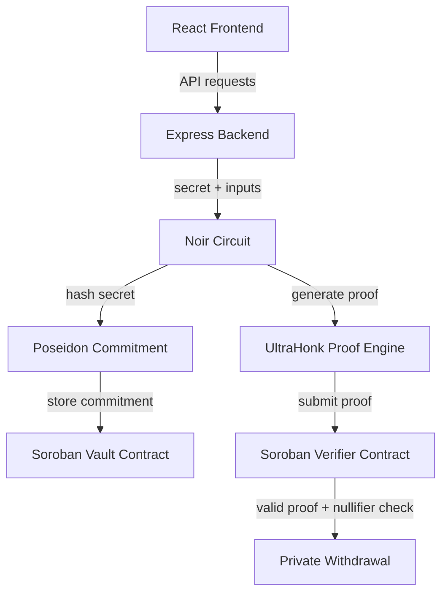
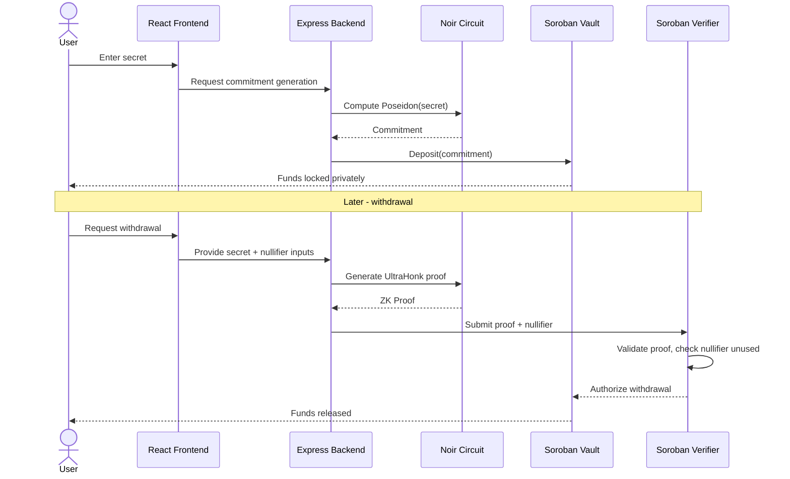

# ShadowVault

> Privacy-preserving vault on Stellar, powered by Zero Knowledge Proofs.

ShadowVault is a privacy-focused vault built on **Stellar Soroban** that lets users securely deposit assets as cryptographic commitments and later prove ownership using **Zero Knowledge Proofs** — without ever revealing their identity, balance, or secret.

Instead of storing sensitive financial information on-chain, ShadowVault stores only a **Poseidon commitment**, enabling private ownership with publicly verifiable correctness.

---

## The Problem

Traditional blockchains are transparent by design. Anyone can see:

- Wallet balances
- Deposits and withdrawals
- Full transaction history
- Treasury movements

Transparency builds trust, but it also leaks sensitive financial data — a dealbreaker for individuals, DAOs, and institutions that need confidentiality.

## The Solution

ShadowVault replaces public ownership records with cryptographic commitments, verified entirely through Zero Knowledge Proofs:

- Deposit funds privately
- Generate a Poseidon commitment
- Store only the commitment on-chain
- Generate a Zero Knowledge ownership proof
- Verify the proof on Stellar via Soroban
- Withdraw securely without revealing private information
- Block replay attacks using nullifiers

---

## Architecture



---

## User Flow

### Deposit


### Withdrawal


---

## End-to-End Flow



---

## Features

| Feature | Description |
|---|---|
| Private Deposits | Assets deposited as commitments, not plaintext records |
| Poseidon Commitments | ZK-friendly hashing for efficient on-chain storage |
| Noir ZK Circuits | Custom circuits define ownership logic |
| UltraHonk Proofs | Fast, succinct proof generation |
| Soroban Verification | On-chain proof verification on Stellar |
| Nullifier Protection | Prevents replay/double-withdrawal attacks |
| Interactive Dashboard | React-based UI for deposits and withdrawals |

---

## Tech Stack

| Layer | Technology |
|---|---|
| Blockchain | Stellar, Soroban Smart Contracts |
| Zero Knowledge | Noir, UltraHonk |
| Cryptography | Poseidon2 Hash |
| Smart Contracts | Rust, Soroban SDK |
| Backend | Node.js, Express.js |
| Frontend | React, Vite |

---

## Project Structure

```
shadow_vault/
├── backend/      # Express API - orchestrates proof & commitment flow
├── frontend/     # React dashboard for deposits/withdrawals
├── contracts/    # Soroban vault & verifier smart contracts
├── circuits/     # Noir ZK circuits
└── artifacts/    # Compiled circuits, proving/verification keys
```

---

## Current MVP

- React Dashboard
- Express Backend
- Noir Circuit Integration
- Poseidon Commitment Generation
- Soroban Vault Contract
- Private Deposit Flow
- Zero Knowledge Proof Pipeline
- Nullifier-based Replay Protection

## Future Scope

- USDC Integration
- Private Treasury Management
- Yield Strategies
- DAO Treasury Support
- ZK Solvency Proofs
- Institutional Vaults
- Wallet Integration (Freighter, etc.)
- Cross-chain Privacy

---

## Why ShadowVault?

ShadowVault combines the privacy guarantees of Zero Knowledge Proofs with the security and speed of Stellar. Instead of exposing financial information publicly, users prove ownership cryptographically — making blockchain applications viable for individuals, DAOs, and institutions that require confidentiality without sacrificing verifiability.

---

## Built With

Stellar, Soroban, Rust, Noir, UltraHonk, React, Express, Vite