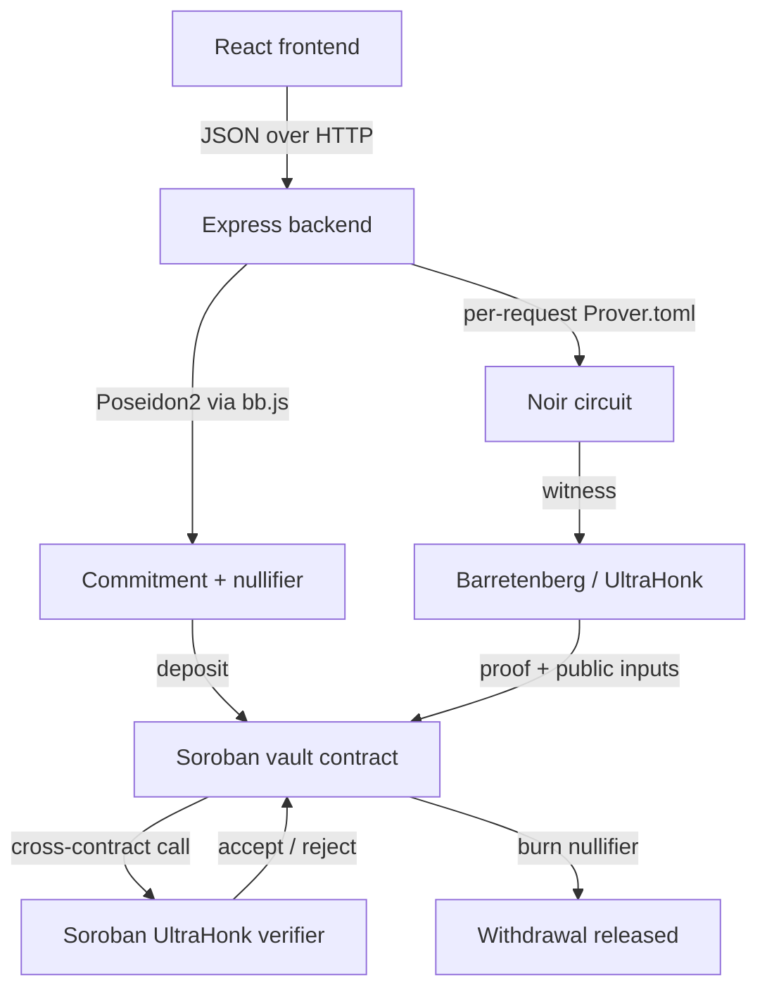

# ShadowVault

> Privacy-preserving vault on Stellar, powered by zero-knowledge proofs.

ShadowVault is a privacy-focused vault built on **Stellar Soroban**. Deposits are recorded as
cryptographic commitments rather than public balances, and ownership is later proved with a
**zero-knowledge proof** that is verified **on-chain** — without revealing the depositor's secret.

The chain stores `Poseidon2(secret, depositId)` and nothing else. Withdrawal requires an UltraHonk
proof that opens that exact commitment, checked by a Soroban verifier contract, with a nullifier
burned so the same proof can never be spent twice.

---

## Table of contents

- [How it works](#how-it-works)
- [Why each check exists](#why-each-check-exists)
- [Architecture](#architecture)
- [Project structure](#project-structure)
- [Prerequisites](#prerequisites)
- [Getting started](#getting-started)
- [Environment variables](#environment-variables)
- [API reference](#api-reference)
- [Contract reference](#contract-reference)
- [Testing](#testing)
- [Scope and limitations](#scope-and-limitations)

---

## How it works

The five stages are strictly sequential; each one is cryptographically bound to the last.

| # | Stage | What happens |
|---|-------|--------------|
| 1 | **Derive commitment** | The backend computes `commitment = Poseidon2([secret, depositId])` and `nullifier = Poseidon2([secret])`. The secret is never stored or sent on-chain. |
| 2 | **Deposit** | The commitment is written to the vault contract under a write-once deposit ID. |
| 3 | **Prove** | A per-request `Prover.toml` is written, `nargo execute` builds the witness, and `bb prove` produces an UltraHonk proof. |
| 4 | **Verify** | The Soroban verifier contract runs the real pairing check against the verification key baked in at deployment. |
| 5 | **Withdraw** | The vault re-verifies the proof itself, confirms it opens *this* deposit, then burns the nullifier. |

### The circuit

```noir
fn main(secret: Field, deposit_id: Field, commitment: pub Field, nullifier: pub Field) {
    assert(Poseidon2::hash([secret, deposit_id], 2) == commitment);
    assert(Poseidon2::hash([secret], 1) == nullifier);
}
```

`secret` and `deposit_id` are private. Public inputs are emitted in declaration order, so the
serialized `public_inputs` file is exactly 64 bytes:

```
[0..32)   commitment   (big-endian field element)
[32..64)  nullifier    (big-endian field element)
```

The vault contract depends on that layout to bind a proof to a deposit.

> The backend computes Poseidon2 with `@aztec/bb.js`, which is byte-identical to Noir's
> `poseidon::poseidon2::Poseidon2::hash`. This is **not** interchangeable with circomlib-style
> Poseidon (e.g. `poseidon-lite`) — those produce different digests and every proof would fail.

---

## Why each check exists

A valid proof on its own proves nothing about *which* deposit it opens. `Vault::withdraw` therefore
checks all of the following, and dropping any one makes the ZK layer decorative:

1. `public_inputs` decodes to exactly two field elements.
2. The nullifier argument equals the nullifier inside the proof.
3. A deposit exists under `deposit_id` and is not already withdrawn.
4. **The proof's commitment equals the stored commitment** — this is what stops a proof for deposit A
   being replayed against deposit B.
5. The nullifier has never been spent.
6. The verifier contract accepts the proof.

Deposit IDs are write-once. Without that, anyone could re-deposit over a live slot, reset its
`withdrawn` flag, and withdraw it a second time.

---

## Architecture


```mermaid
flowchart TB
    A["React frontend"] -->|JSON over HTTP| B["Express backend"]
    B -->|Poseidon2 via bb.js| C["Commitment + nullifier"]
    B -->|per-request Prover.toml| D["Noir circuit"]
    D -->|witness| E["Barretenberg / UltraHonk"]
    C -->|deposit| F["Soroban vault contract"]
    E -->|proof + public inputs| F
    F -->|cross-contract call| G["Soroban UltraHonk verifier"]
    G -->|accept / reject| F
    F -->|burn nullifier| H["Withdrawal released"]
```

---

## Project structure

```
shadow_vault/
├── backend/                  Express API
│   ├── lib/
│   │   ├── poseidon.js       Poseidon2 over BN254 (matches the circuit exactly)
│   │   ├── circuit.js        Per-request witness + proof generation
│   │   ├── stellar.js        Contract invocation via execFile (never a shell)
│   │   ├── validate.js       Input validation at the edge
│   │   └── errors.js         Contract error codes -> readable messages
│   └── routes/index.js       The five pipeline endpoints
├── frontend/                 React + Vite dashboard
│   └── src/
│       ├── index.css         Design tokens and component styles
│       ├── context/          Sequential pipeline state
│       └── components/
├── circuits/ownership_vault/ Noir circuit
├── contracts/vault/          Soroban vault contract
└── rs-soroban-ultrahonk/     Submodule: UltraHonk verifier for Soroban
```

---

## Prerequisites

| Tool | Version used | Install |
|------|--------------|---------|
| Node.js | 20+ | https://nodejs.org |
| Rust + Cargo | 1.93+ | https://rustup.rs |
| Stellar CLI | 27.0.0 | `cargo install --locked stellar-cli` |
| Nargo (Noir) | 1.0.0-beta.9 | `curl -L noirup.dev \| bash && noirup -v 1.0.0-beta.9` |
| Barretenberg (`bb`) | 0.87.0 | `curl -L bbup.dev \| bash && bbup -v 0.87.0` |
| Docker | any | for the local Stellar network |

The Noir and `bb` versions must match — proofs from a different `bb` will not verify against a
verification key written by another version.

---

## Getting started

### 1. Clone with submodules

```bash
git clone --recurse-submodules https://github.com/Abhist17/shadow_vault.git
cd shadow_vault
```

Already cloned without `--recurse-submodules`? Run `git submodule update --init --recursive`.

### 2. Start a local Stellar network

```bash
cd rs-soroban-ultrahonk
bash scripts/start_stellar.sh
```

This starts the `stellar/quickstart` container on `localhost:8000`, registers the `local` network
profile, and waits for friendbot.

### 3. Fund a signing identity

```bash
stellar keys generate alice --network local
curl "http://localhost:8000/friendbot?addr=$(stellar keys address alice)"
```

### 4. Build the circuit and its verification key

```bash
cd circuits/ownership_vault
nargo compile
nargo execute
bb write_vk --scheme ultra_honk --oracle_hash keccak \
  --bytecode_path target/ownership_vault.json \
  --output_path target --output_format bytes_and_fields
```

`--oracle_hash keccak` is mandatory. The Soroban verifier rebuilds the Fiat-Shamir transcript with
keccak, so a proof generated with the default oracle verifies locally and is rejected on-chain.

### 5. Deploy the verifier, keyed to this circuit

```bash
cd ../../rs-soroban-ultrahonk
cargo build --release --target wasm32v1-none --package identity

stellar contract deploy \
  --wasm target/wasm32v1-none/release/identity.wasm \
  --source alice --network local -- \
  --vk_bytes-file-path ../circuits/ownership_vault/target/vk
```

The verification key is immutable once deployed, so the circuit a vault trusts can never be swapped.
Save the returned contract ID as `VERIFIER_CONTRACT_ID`.

### 6. Deploy the vault, bound to that verifier

```bash
cd ../contracts/vault
stellar contract build

stellar contract deploy \
  --wasm target/wasm32v1-none/release/vault.wasm \
  --source alice --network local -- \
  --verifier <VERIFIER_CONTRACT_ID>
```

Save the returned contract ID as `VAULT_CONTRACT_ID`.

### 7. Configure and run

```bash
cd ../../backend
npm install
cp .env.example .env      # fill in the two contract IDs
npm run dev

# in a second terminal
cd ../frontend
npm install
cp .env.example .env
npm run dev
```

Open http://localhost:5173 and run the flow from the dashboard.

---

## Environment variables

### Backend (`backend/.env`)

| Variable | Required | Description |
|----------|----------|-------------|
| `PORT` | no | API port (default `5000`) |
| `STELLAR_NETWORK` | no | Network profile name (default `local`) |
| `STELLAR_SOURCE_ACCOUNT` | no | Signing identity (default `alice`) |
| `VAULT_CONTRACT_ID` | **yes** | Deployed vault contract |
| `VERIFIER_CONTRACT_ID` | **yes** | Deployed verifier contract |
| `NARGO_BIN` / `BB_BIN` / `STELLAR_BIN` | no | Absolute paths; resolved from `PATH` when unset |
| `CIRCUIT_DIR` | no | Override the circuit package location |

### Frontend (`frontend/.env`)

| Variable | Required | Description |
|----------|----------|-------------|
| `VITE_API_URL` | no | Backend URL (default `http://localhost:5000`) |

---

## API reference

All responses are `{ success: true, ... }` or `{ success: false, error: "<readable message>" }`.

| Method | Route | Body | Purpose |
|--------|-------|------|---------|
| `GET` | `/health` | — | Contract IDs and resolved signing address |
| `POST` | `/deposit` | `{ secret, depositId, amount }` | Derive commitment + nullifier (no chain access) |
| `POST` | `/deposit-stellar` | `{ depositId, commitment, amount }` | Record the commitment on-chain |
| `POST` | `/proof` | `{ secret, depositId }` | Generate an UltraHonk proof |
| `POST` | `/verify` | `{ depositId }` | Check the proof against the verifier contract |
| `POST` | `/withdraw` | `{ depositId }` | Withdraw; the vault re-verifies and burns the nullifier |
| `GET` | `/deposit/:depositId` | — | Read the on-chain deposit record |

---

## Contract reference

`Vault` (`contracts/vault/src/lib.rs`):

| Function | Notes |
|----------|-------|
| `__constructor(verifier)` | Binds the vault to a verifier. Immutable. |
| `deposit(depositor, deposit_id, commitment, amount)` | Requires auth; deposit IDs are write-once. |
| `get_deposit(deposit_id)` | Returns the stored record. |
| `withdraw(deposit_id, nullifier, public_inputs, proof)` | Runs all six binding checks above. |
| `is_nullifier_used(nullifier)` | Replay-guard lookup. |

Error codes surfaced as `Error(Contract, #N)`:

| # | Meaning | # | Meaning |
|---|---------|---|---------|
| 1 | AlreadyWithdrawn | 7 | NullifierMismatch |
| 2 | DepositNotFound | 8 | ProofRejected |
| 3 | DepositIdTaken | 9 | InvalidAmount |
| 4 | NullifierAlreadyUsed | 10 | AlreadyInitialized |
| 5 | CommitmentMismatch | 11 | VerifierNotSet |
| 6 | MalformedPublicInputs | | |

---

## Testing

```bash
# Circuit — asserts the commitment/nullifier vector the backend also produces
cd circuits/ownership_vault && nargo test

# Frontend
cd frontend && npx eslint . && npm run build
```

The security properties were exercised against a live local network:

| Scenario | Result |
|----------|--------|
| Valid proof, correct deposit | withdraws |
| Replay the same proof | `#1 AlreadyWithdrawn` |
| Re-deposit over a live ID | `#3 DepositIdTaken` |
| Valid proof aimed at a different deposit | `#5 CommitmentMismatch` |
| Proof generated from the wrong secret | `#5 CommitmentMismatch` |
| Deposit signed by the wrong account | rejected before submission |
| Shell metacharacters in `depositId` | rejected by input validation |

---

## Scope and limitations

Worth being explicit about what this does and does not do:

- **No token custody.** `amount` is recorded alongside the commitment; the vault does not hold or
  transfer real XLM or any token contract balance. Adding custody means wiring a token contract into
  `deposit`/`withdraw`.
- **The backend holds the signing key.** It submits transactions on the user's behalf, so it is
  trusted for liveness and ordering. It never sees more than the user types, and the secret is not
  persisted, but a production build would sign in the browser via a wallet.
- **Nullifiers are per-secret, not per-deposit.** `Poseidon2([secret])` means one secret can be
  withdrawn once across all deposits. Reusing a secret for a second deposit makes it unwithdrawable.
- **One verifier per circuit.** The verification key is fixed at deployment, so changing the circuit
  requires redeploying both contracts.
